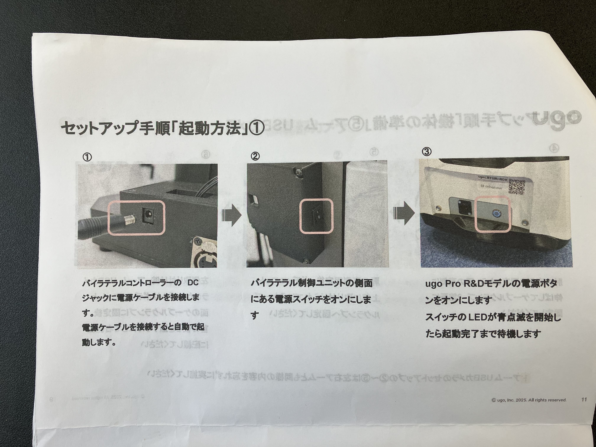
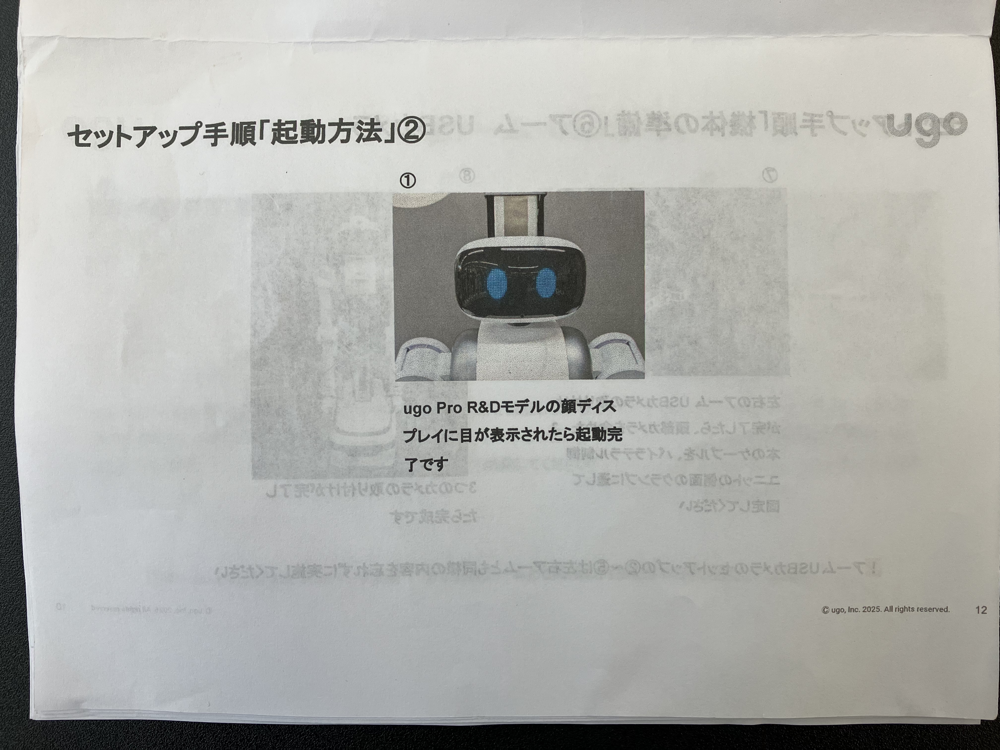
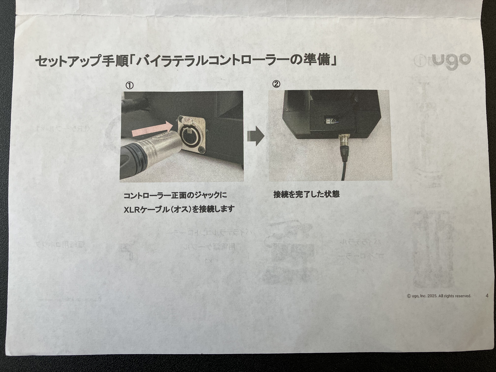
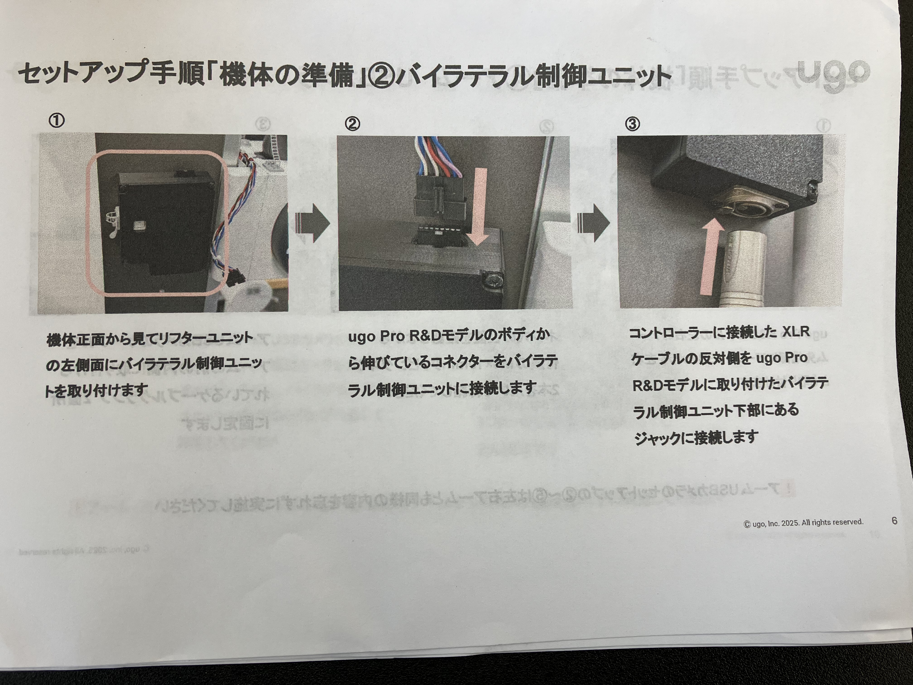
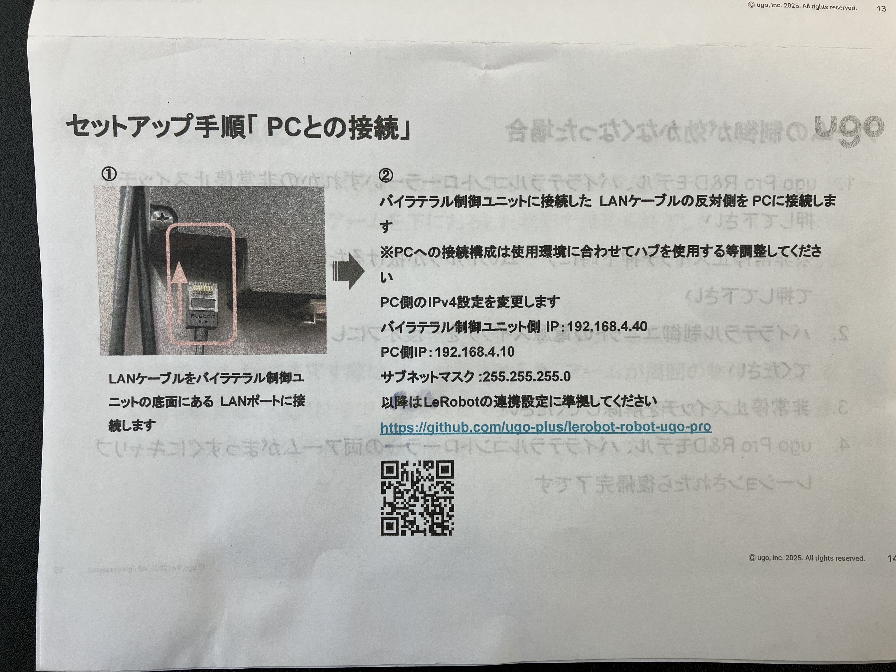
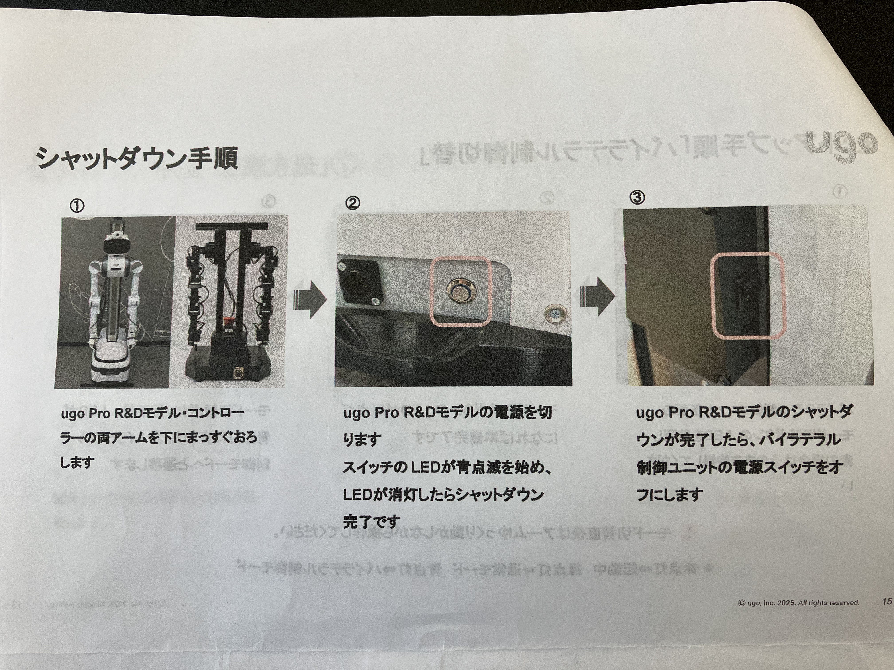
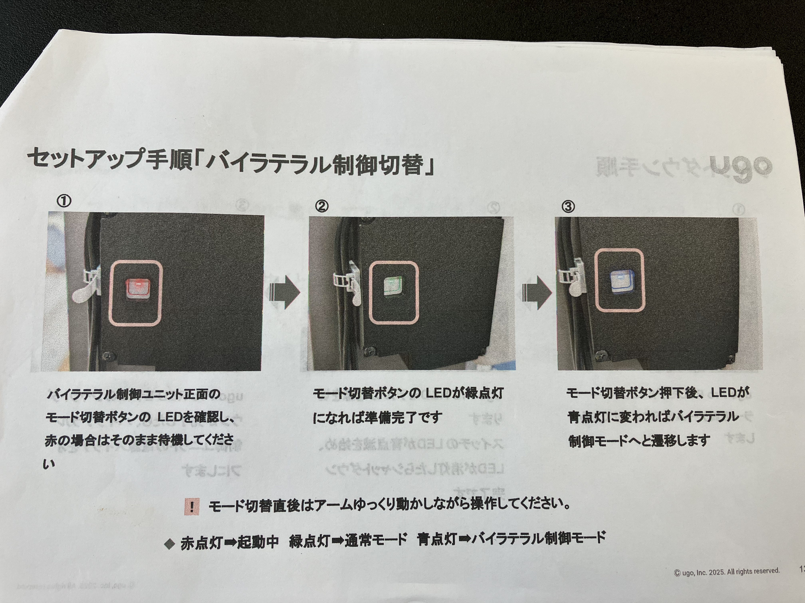
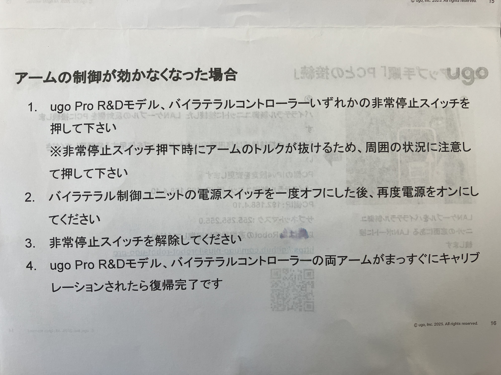

# 作業開始前と作業終了後にやること

## 作業前

### ロボットとコントローラーの起動

以下の画像の内容に従って起動





### ロボットの高さ調整

- Ugo-Proをネットワークに接続して、ロボットの高さを調節（アクセス情報は別で共有）
- 有線でネットワークに接続してから、認識されるまでに時間がかかる場合はUgo-Proを再起動

接続情報

- URL：https://ugo-portal.com/auth/login
- ユーザ名：xxxxxx
- パスワード：xxxxxxx

### Uro-Proとリーダー機の接続

以下の画像の内容に従ってUgo-Pro（バイラテラルユニット）とリーダー機を接続。ここまででテレオペレーションは可能。バイラテラルユニットの制御切り替えについては[ここ](#バイラテラルユニットの制御切り替え方法)を参照





### Uro-ProとPCの接続

以下の画像の内容に従ってUgo-Pro（バイラテラルユニット）とPCを接続。



### セットアップ

1. Ugo-Pro、テーブル、箱の初期位置をセットアップ
2. vscodeで`uv run lerobot-find-cameras`でカメラを認識させて、`outputs/captured_images/`にフロントカメラ、左手のカメラ、右手のカメラが映ることを確認（各種カメラのUSBを指定の口に挿入）
3. 上記でカメラの認識をした時のcameraのインデックスをsetup.shファイルの以下の内容にIDを設定

    ```.sh
    export FRONT_CAM_ID="<front cam id>"  # Set front cam id. Example: FRONT_CAM_ID="0"
    export LEFT_CAM_ID="<left cam id>"  # Set left cam id. Example: FRONT_CAM_ID="4"
    export RIGHT_CAM_ID="<right cam id>"  # Set right cam id. Example: FRONT_CAM_ID="6"
    ```

4. `source setup.sh`を実行し定数を設定
5. `echo $FRONT_CAM_ID`で設定したフロントカメラIDが表示されることを確認

※バッテリーがなくなると動かなくなるため、充電しながら作業

## 作業終了後

### シャットダウン

以下の画像の内容に従って、バイラテラル制御ユニットとUgo-Proの電源をOFF



## その他

### バイラテラルユニットの制御切り替え方法

バイラテラルユニットの制御切り替え方法は以下の画像のとおり




### アームの制御が効かない場合

アームの制御が効かない場合は、以下の画像の内容に従って再接続


